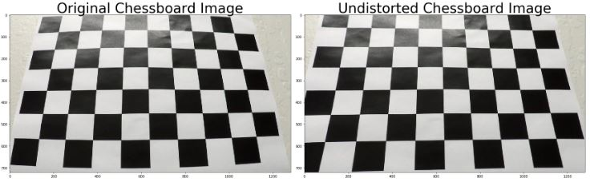

## Advanced Lane Finding

---

**Advanced Lane Finding Project**

The goals / steps of this project are the following:

* Compute the camera calibration matrix and distortion coefficients given a set of chessboard images.
* Apply a distortion correction to raw images.
* Use color transforms, gradients, etc., to create a thresholded binary image.
* Apply a perspective transform to rectify binary image ("birds-eye view").
* Detect lane pixels and fit to find the lane boundary.
* Determine the curvature of the lane and vehicle position with respect to center.
* Warp the detected lane boundaries back onto the original image.
* Output visual display of the lane boundaries and numerical estimation of lane curvature and vehicle position.

[//]: # (Image References)

[image1]: ./examples/undistort_output.png "Undistorted"
[image2]: ./test_images/test1.jpg "Road Transformed"
[image3]: ./examples/binary_combo_example.jpg "Binary Example"
[image4]: ./examples/warped_straight_lines.jpg "Warp Example"
[image5]: ./examples/color_fit_lines.jpg "Fit Visual"
[image6]: ./examples/example_output.jpg "Output"
[video1]: ./project_video.mp4 "Video"

## [Rubric](https://review.udacity.com/#!/rubrics/571/view) Points

### Here I will consider the rubric points individually and describe how I addressed each point in my implementation.  

---

### Camera Calibration

#### 1. Briefly state how you computed the camera matrix and distortion coefficients. Provide an example of a distortion corrected calibration image.

The code for camaera calibration and the distortion correction is contained in cells 3 and 5 of the IPython notebook.

I start by preparing "object points", which will be the (x, y, z) coordinates of the chessboard corners in the world. Here I am assuming the chessboard is fixed on the (x, y) plane at z=0, such that the object points are the same for each calibration image.  Thus, `objp` is just a replicated array of coordinates, and `objpoints` will be appended with a copy of it every time I successfully detect all chessboard corners in a test image.  `imgpoints` will be appended with the (x, y) pixel position of each of the corners in the image plane with each successful chessboard detection.  

I then used the output `objpoints` and `imgpoints` to compute the camera calibration and distortion coefficients using the `cv2.calibrateCamera()` function.  I applied this distortion correction to the test image using the `cv2.undistort()` function and obtained this result: 

### Pipeline (single images)

#### 1. Provide an example of a distortion-corrected image.

To demonstrate this step, I will describe how I apply the distortion correction to one of the test images like this one:
![alt text][ReadmeImages/TestImageDistortionCorrection.JPG]

#### 2. Describe how (and identify where in your code) you used color transforms, gradients or other methods to create a thresholded binary image.  Provide an example of a binary image result.

I used a combination of color and gradient thresholds to generate a binary image. I have defined functions that will take absolute sobel thresholds, magnitude of the gradient, and direction threshold of the gradient but only ended up using absolute sobel and direction in my combination of thresholding functions. However In the Advanced Lanes html file or in the ipynb file you can see examples of each individual thresholding function in action on a single image. Below is an example of the combination of gradient thresholds on a single image. 

![alt text][ReadmeImages/CombinationThresholds.JPG]

Along with using gradient thresholds, I also used color channel thresholds and the HLS color space while separting the S and L channels. Finally I used a mask area function to filter out any unwanted parts of the images. This is all done in the initial pipeline(img) function. Below is an example of an image after thresholding and masking. 

![alt text][ReadmeImages/AllThresholdsandMasking.JPG]

#### 3. Describe how (and identify where in your code) you performed a perspective transform and provide an example of a transformed image.

The code for my perspective transform takes a sample image and manually extracts vertives to warp into a birds-eye view. Below is the code that includes the source and destintation points. 

![alt text][ReadmeImages/PerspectiveTransformCode.JPG]

This resulted in the following source and destination points:

| Source         | Destination    | 
|:--------------:|:--------------:| 
| 220,  720      | 320, 720       |
| 1110, 720      | 920, 720       |
| 722,  470      | 920, 1         |
| 570,  470      | 320, 1         |

I verified that my perspective transform was working as expected by drawing the `src` and `dst` points onto a test image and its warped counterpart to verify that the lines appear parallel in the warped image. Below is an example of an original image with its warped counterpart. This show the lines curving. 

![alt text][ReadmeImages/PerspectiveTransformExample.JPG]

#### 4. Describe how (and identify where in your code) you identified lane-line pixels and fit their positions with a polynomial?

Then I did some other stuff and fit my lane lines with a 2nd order polynomial kinda like this:

![alt text][ReadmeImages/PolynomialOfficialExample.JPG]

By performing a sliding window search and finding the 2 lanes by using the histogram approach I was able to create my own interpretation of the above image and eventually fit a polynomial. Below are visualizations of the histogram, the sliding window process, and then the polynomial fit.

![alt text][ReadmeImages/Histogram.JPG]
![alt text][ReadmeImages/SlidingWindows.JPG]
![alt text][ReadmeImages/PolynomialFit.JPG]

#### 5. Describe how (and identify where in your code) you calculated the radius of curvature of the lane and the position of the vehicle with respect to center.

By using coversions of meters per pixel in the x and y dimension I was able to fit new polynomials to x and y in world space. This allowed me to calculate the radius of curvature and the center offset. Below is the code and the output. 

![alt text][ReadmeImages/RadiusOfCurvature.JPG]

#### 6. Provide an example image of your result plotted back down onto the road such that the lane area is identified clearly.

Below I have given the code and image of my result plotted back down onto the road with lane area clearly identified and colored in. The image had to be unwarped as well. 

![alt text][ReadmeImages/UnwarpCode.JPG]
![alt text][ReadmeImages/UnwarpedImage.JPG]

---

### Pipeline (video)

#### 1. Provide a link to your final video output.  Your pipeline should perform reasonably well on the entire project video (wobbly lines are ok but no catastrophic failures that would cause the car to drive off the road!).

Here's a [link to my video result](./project_video_output.mp4)

<video controls src="project_video_output.mp4" / | width = 750>

### Pipeline (Challenge Video)

Here is also a [link to my challenge video](./challenge_video_output.mp4) 

<video controls src="challenge_video_output.mp4" / | width = 750>
---

### Discussion

#### 1. Briefly discuss any problems / issues you faced in your implementation of this project. 

There was a lot of experimentation in the gradient and color thresholding stage. Even though I included all funcitons for thresholding. I only used two of the gradient thresholds and proceeded to use color thresholding and masking. 

To solve the issue of bad frames where I could not get a accurate polynomial fit based on a previous frame, I had to implement a search_forced function which basically started the process from scratch on that specfic frame. The function took in the warped image and used thresholding and sliding windows to again find the correct polynomial fit for the lane lines and then returned those values. 

As you can tell, the challenge video seems to have alittle problem when going under a bridge because of the shadow. It doesnt completely lose its sight of the lanes but it could still be problematic for a real vehicle when the riders safety is the number one concern. I think in the future I could have used the gradient thresholding and the color thresholding a little bit better so I can account for these events. 
